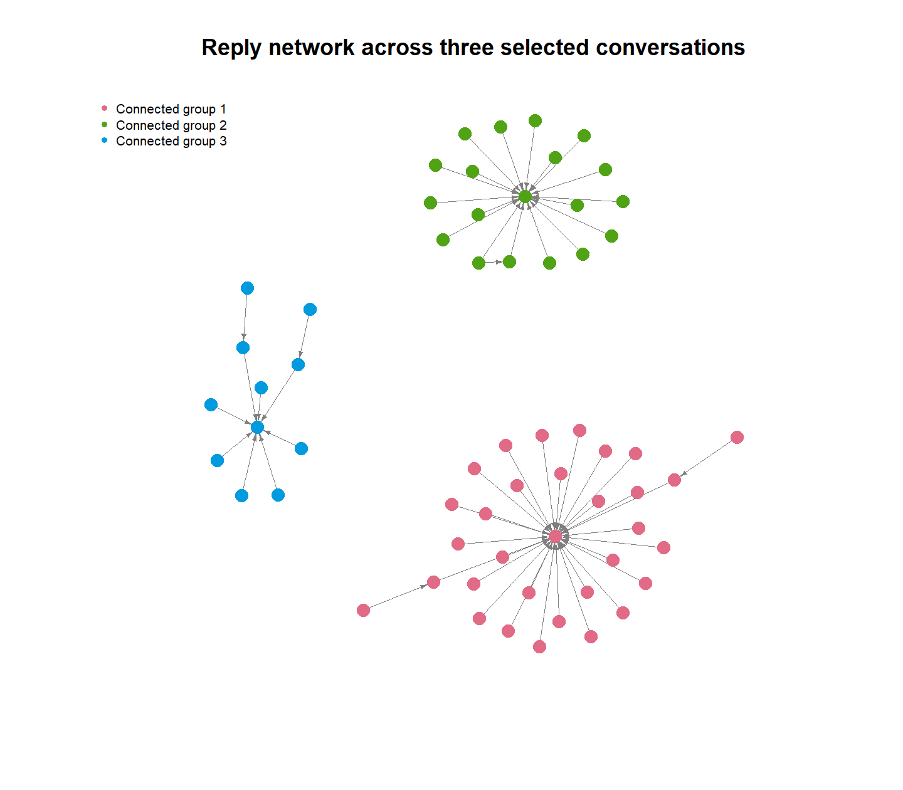
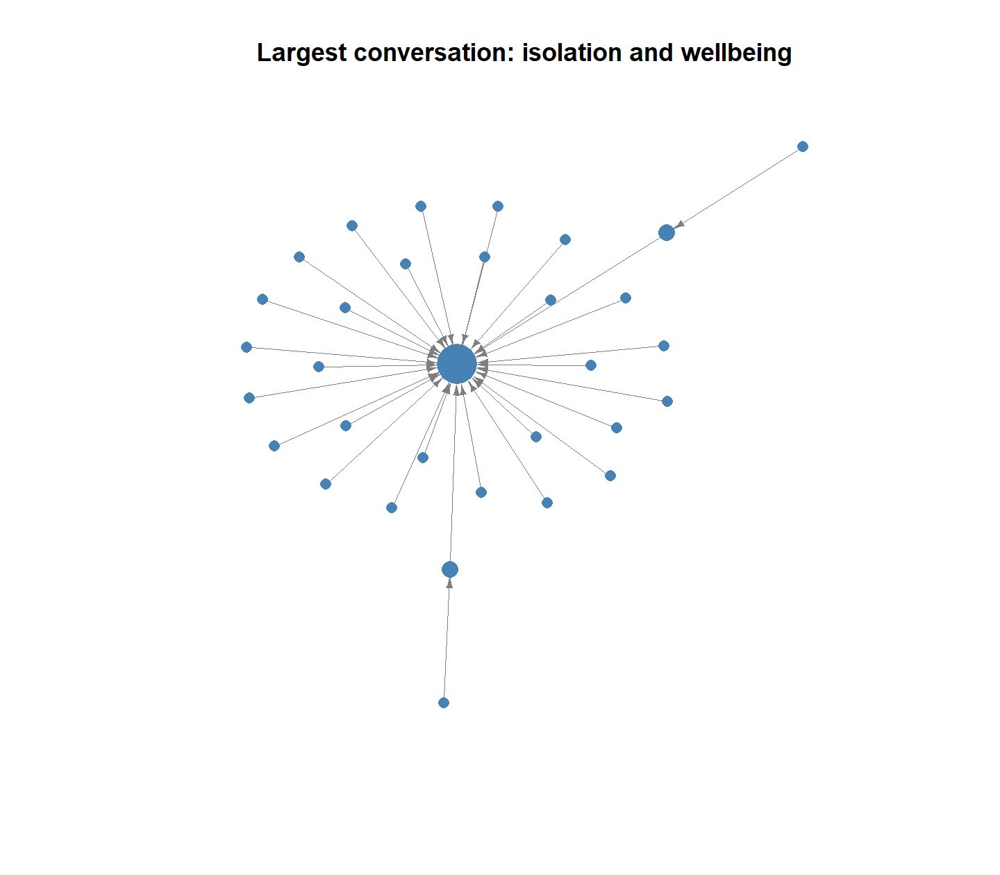

```{r setup, include=FALSE}
source("scripts/06_thread_analysis.R")
```

# 1 Introduction

We chose to examine working from home vs returning to the office because it becomes interesting when you consider people's concerns about well being, costs and job competition. Our aim was to use Bluesky posts to compare sentiment between the two search groups, examine common words and themes, and analyse reply patterns for selected posts.

Our research questions were:

1. What common words and themes appear in the posts from the two search groups?
2. How do sentiment categories compare between the return-to-office and remote-work search groups?
3. How do accounts interact through replies around our three selected posts?

# 2 Analysis

## 2.1 Data collection and preparation

We collected Bluesky posts using the search phrases “return to office” and “remote work”. For each search, we requested 500 posts, with the results ordered by latest. We saved the raw results separately and combined the datasets for analysis. We labelled posts as RTO or WFH based on the search they came from. Basic cleaning removed posts with missing text, posts with 10 characters or fewer, and repeated posts using their URIs. The two labels describe the search groups rather than whether people preferred working from home or returning to the office.

## 2.2 Text analysis

[Add the final text figures and explain what each shows.]

## 2.3 Hypothesis testing

[Add the hypotheses, test method, assumptions, final results and interpretation.]

## 2.4 Clustering

[Add the text representation, distance, method, cluster-count choice, figure and interpretation.]


## 2.5 Network analysis

We collected responses around three selected posts about working from home vs returning to the office to analyse how people interacted when discussing mental health, related costs, remote work and job competition.

### Data and graph construction

We requested the selected posts and up to two levels of replies, so we used replies to the selected post and replies to those replies. We did not request earlier posts higher up in the thread. We combined the saved responses while removing repeated posts using URIs, leaving 66 posts.

There were 62 different accounts in the network, and we added a connection from the replying account to the account it replied to when both posts were in the collected data.

Connections were excluded where the account was replying to itself. If connections between the same accounts were repeated in the same direction, we counted them only once, leaving 60 directed connections.

### Content review and scope

After reviewing the posts, we labelled 33 as workplace discussion, 26 as context, 6 as unclear and only 1 as off topic.

We used these labels to describe content rather than removing posts from the network.

collected accounts and reply connection remained included also.

the results show interactions for 3 selected posts and are not meant to represent preferences across Bluesky as a whole.

### Network structure

```{r network-structure, echo=FALSE}
structure_table <- data.frame(
  Measure = c(
    "Retrieved posts", "Accounts", "Directed edges",
    "Directed density", "Isolated accounts",
    "Weak components", "Largest component: accounts"
  ),
  Value = as.character(c(
    thread_summary$posts,
    thread_summary$accounts,
    thread_summary$connections,
    thread_summary$density,
    thread_summary$isolated_accounts,
    thread_summary$connected_groups,
    thread_summary$largest_group
  ))
)

knitr::kable(
  structure_table,
  caption = "Structure of the observed reply network"
)
```

The network density was 0.0159. This means about 1.59% of the possible directed connections between different accounts were present.

The network had three connected groups, called weak components, containing 32, 19 and 11 accounts. We identified these groups by checking which accounts were connected while ignoring the direction of the arrows. We did not observe any connections between the three groups in the collected data.

```{r full-network, echo=FALSE, out.width="90%", fig.align="center", fig.cap="Observed reply network across three selected conversations (62 accounts, 60 edges). Arrows point from replying authors to parent authors; colours identify weak components."}

```

### Largest connected conversation

We chose the largest weak component to get a clearer view of the conversation with the most accounts. Its selected post discussed workplace isolation and mental health. This group contained 32 accounts and 31 directed connections. We calculated the network statistics and centrality scores using the full network.

```{r largest-network, echo=FALSE, out.width="90%", fig.align="center", fig.cap="Largest weak component: isolation and wellbeing (32 accounts, 31 edges). Node size increases with in-degree."}

```

\clearpage

### Account centrality

We used two centrality measures: in-degree and raw, or unnormalised, directed betweenness. The table shows the three accounts with the highest in-degree and all accounts with a betweenness score above zero.

```{r account-centrality, echo=FALSE}
centrality_table <- unique(rbind(
  head(reply_ranking, 3),
  between_ranking[between_ranking$betweenness > 0, ]
))

knitr::kable(
  centrality_table,
  row.names = FALSE,
  col.names = c("Account", "In-degree", "Raw betweenness"),
  caption = "Accounts with the three highest in-degrees or positive directed betweenness"
)
```

In-degree counts how many different accounts have a reply connection pointing to an author. The accounts cnn.com, rincewind.run and shockemc.bsky.social received connections from 29, 18 and eight different accounts respectively. These accounts wrote the three selected posts, so the way we collected the conversations favours them as reply targets. Replies indicate engagement within these conversations, but they do not establish agreement or endorsement.

Directed betweenness measures an account's role on the shortest paths between other accounts, following the direction of the arrows. The accounts at the start and end of a path are not counted as intermediaries. The three accounts with the highest in-degree all had a betweenness score of zero. Receiving many replies therefore did not mean they acted as links between other accounts.

The accounts goodboy.bsky.social, nasboat.org, nk-dizzle.bsky.social and trekkiebill.bsky.social each had a raw betweenness score of one. These small scores show a limited role as intermediaries within the recorded reply paths. They do not show that these accounts connect the three separate groups or have influence across Bluesky.

### Limitations

We used 3 selected posts to collect replies, so the network does not show all the reply connections these accounts may have. Our requests went as far as two reply levels, excluding posts from higher up in the thread. Before we added a reply connection, both posts had to be collected. Connections might therefore have been left out because the posts were outside our requests or because the API didn't return them. The inclusion of more complete data could potentially change the groups and centrality scores.

Most replies were around the selected posts. With only two reply levels, there are few longer paths for betweenness to measure. This means the scores partly reflect how we collected the data. The 3 groups could be linked by replies we did not collect. They do not tell us which work arrangement people support or how common those opinions are across Bluesky.

The text and context did not give us enough information to label 6 posts more clearly. We did not check media, so that information is missing from our content review. We still kept all 66 posts, including the unclear and off-topic ones. An account's colour or position on the graph does not tell us its workplace preference. These network review counts come from a separate sample from the group's keyword-based content analysis.

# 3 Discussion

[Connect the findings to our research questions and explain the overall limitations.]

# 4 Conclusion

[Answer the research questions once all results are confirmed.]

# 5 References

[Add the sources, packages and methods used.]

**Project repository:** https://github.com/AlexanderManalo19385596/comp3020-bluesky-rto-wfh